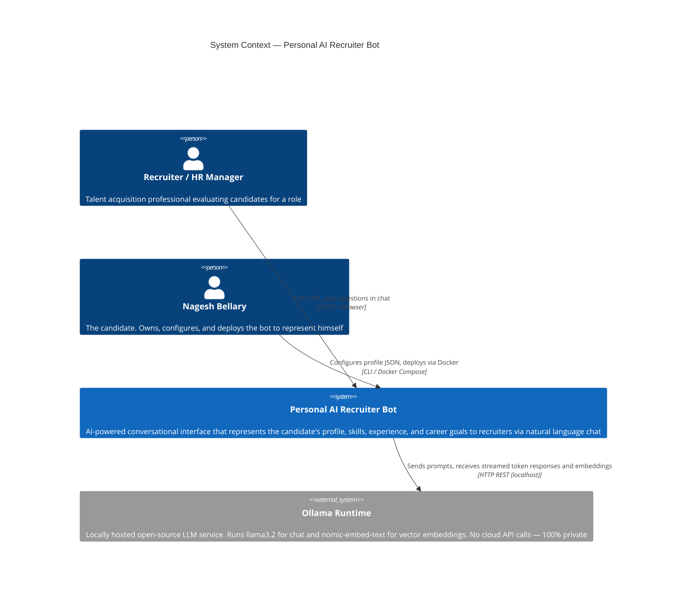
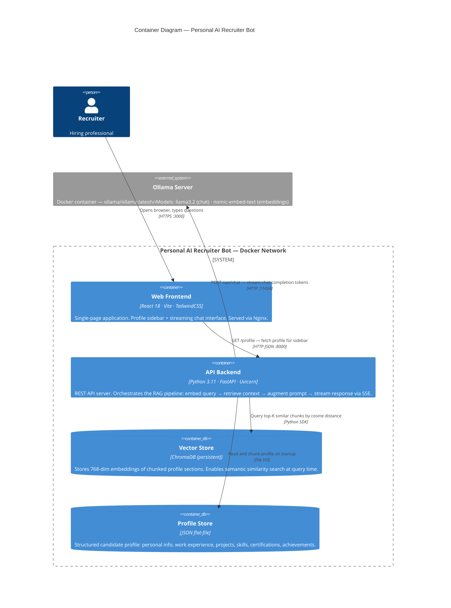
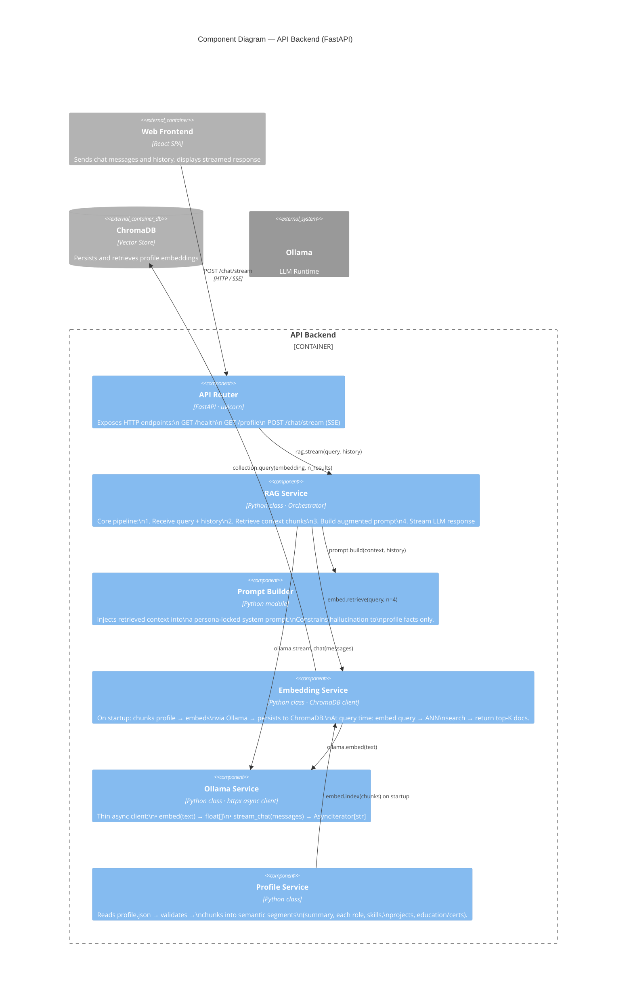
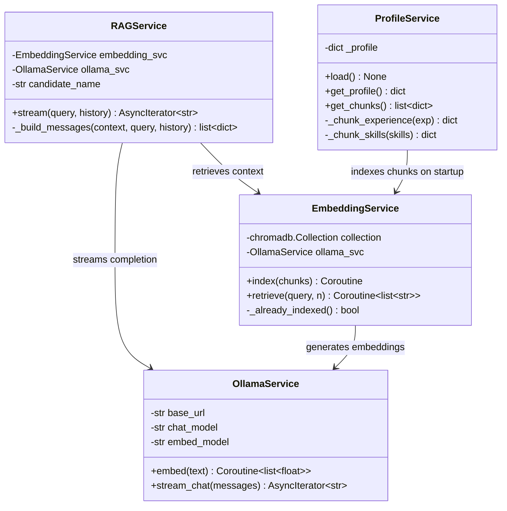
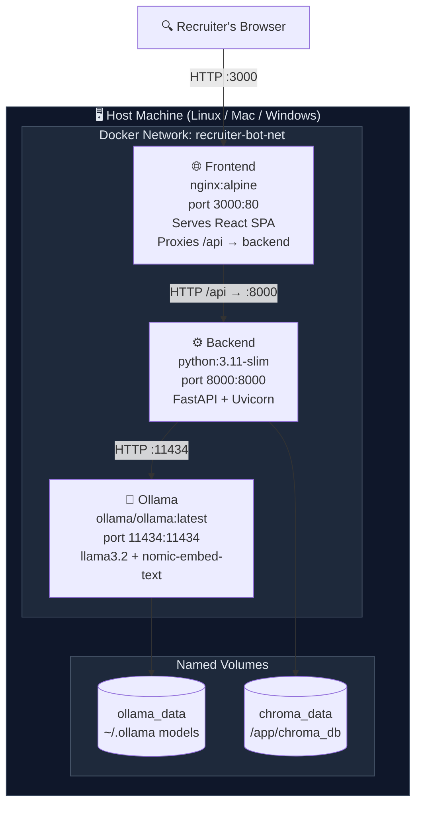
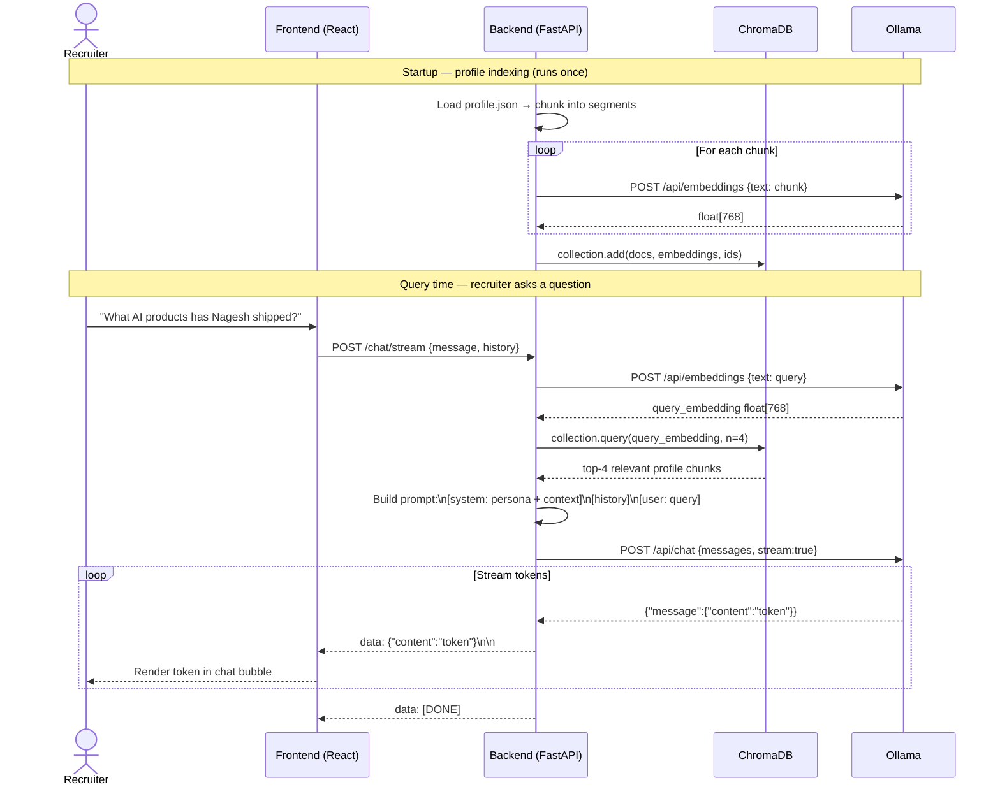

# C4 Architecture Diagrams — Personal AI Recruiter Bot

> Designed using the C4 Model (Simon Brown) — four levels of progressive detail.

---

## Level 1 — System Context

> Who uses the system and what external systems does it touch?

---

## Level 2 — Container Diagram

> What deployable units make up the system?

---

## Level 3 — Component Diagram (API Backend)

> What are the internal building blocks of the backend?

---

## Level 4 — Code Diagram (RAG Pipeline Class Design)

> Key class relationships inside the RAG service.

---

## Deployment Architecture

> How does the system run end-to-end on a single host?

---

## RAG Data Flow

> Step-by-step flow of a single recruiter query.

